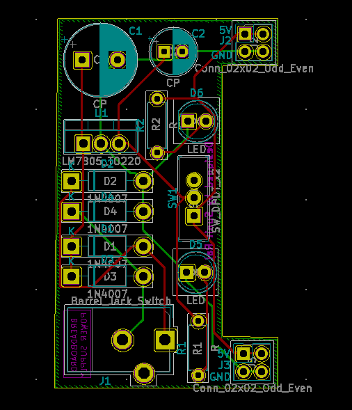

# Breakboard Power Supply


This project is a part of the course "Tech Explorations™ KiCad Like a Pro 2nd edition" and in this project we design a 
breadboard power supply(5V) using KiCad, which can be used with Arduino. I would like to thank Peter Dalmaris for making this wonderful course.

### Prerequisites
The prerequisites are given below
```
*KiCad
```
### Components
```
* 1x  Linear Regulator
* 4x Rectifier diodes
* 1x 470uF capacitor
* 2x Polarized capacitor
* 2x Led 
* 1x 560 ohms resistors 
* 1x Switch DPDT 
* 1x Connector 2x2 odd_even 
```

### PCB Layout

 

 ###  INSTRUCTION 
  1. Download the Gerber zip file
  2. To view the layouts you can go to [gerlook](http://gerblook.org/)
  3. To fabricate, you can upload the the gerber file to oshpark,pcbway
  
  
  
  ### NOTE 
  This is for Educational Purpose only


